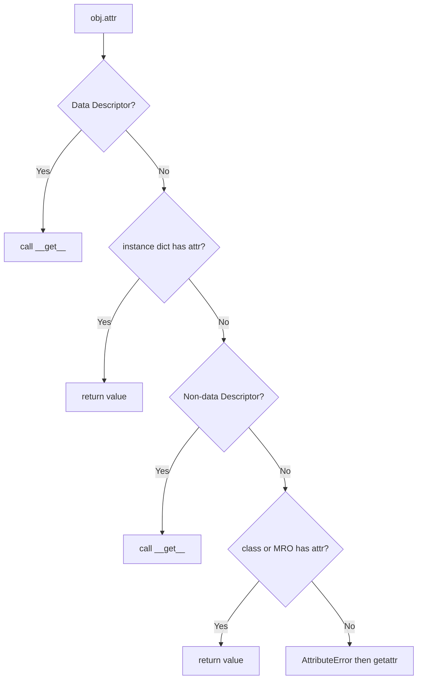
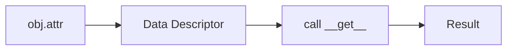
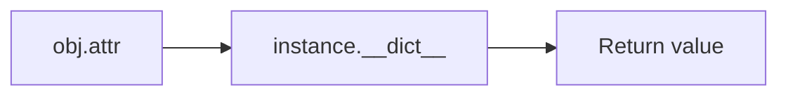
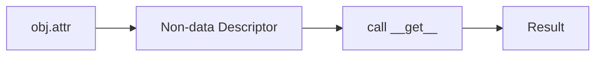
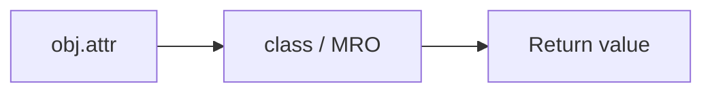
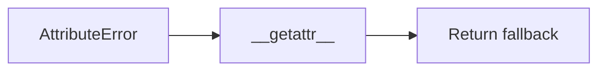
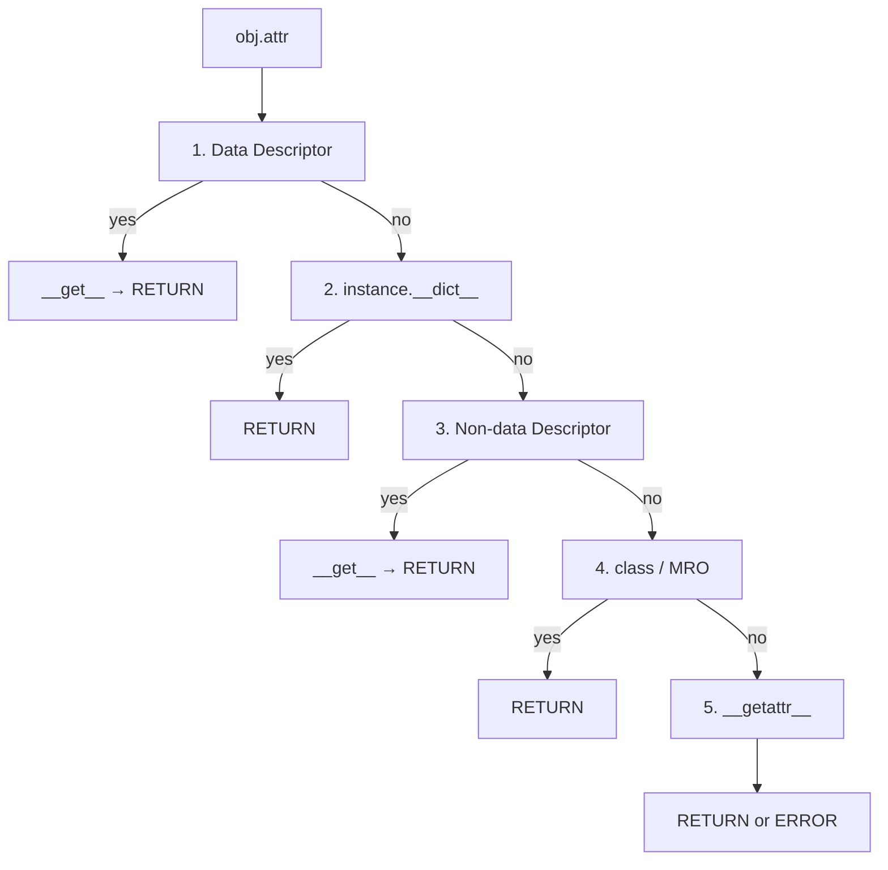
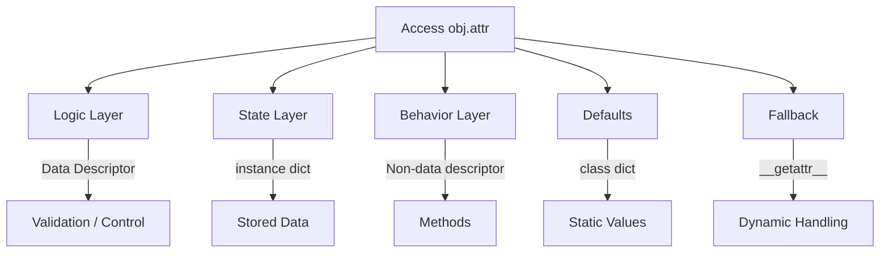

# 🧠 Ієрархія пошуку атрибутів у Python (`__getattribute__`)

## 🔍 Загальна ідея

```text
obj.attr → Python запускає алгоритм пошуку
```

---

## 🔁 Повний алгоритм



---

# 🥇 1. Data Descriptor (найвищий пріоритет)

👉 Атрибут у класі має:

* `__get__`
* і **`__set__` або `__delete__`**

---

### 💡 Приклад

```python
class A:
    @property
    def x(self):
        return 100

a = A()
a.x
```

---

### ⚠️ Навіть якщо:

```python
a.__dict__['x'] = 999
```

```python
print(a.x)  # → 100
```

---

### 🧠 Інсайт

```text
Data descriptor = повний контроль над атрибутом
```

---

## 🔁 Візуалізація

---



---

# 🥈 2. instance.**dict**

👉 Якщо descriptor не знайдено:

```python
a.__dict__['x']
```

---

### 💡 Приклад

```python
class A:
    pass

a = A()
a.x = 10

print(a.x)  # → 10
```

---

### 🧠 Інсайт

```text
instance.__dict__ = реальний стан об’єкта
```

---

## 🔁 Візуалізація



---

# 🥉 3. Non-data Descriptor

👉 Має тільки `__get__`, без `__set__`

---

### 💡 Приклад

```python
class A:
    def method(self):
        return 42

a = A()
```

---

```python
print(a.method)  # bound method
```

---

### ⚠️ Можна перезаписати

```python
a.method = 100
print(a.method)  # → 100
```

---

### 🧠 Інсайт

```text
Non-data descriptor можна перекрити instance значенням
```

---

## 🔁 Візуалізація



---


# 🏁 4. Class / MRO

👉 Якщо нічого не знайдено раніше:

```python
class A:
    x = 50

a = A()
print(a.x)
```

---

### 🧠 Інсайт

```text
class.__dict__ = fallback рівень
```

---

## 🔁 Візуалізація



---

# 💀 5. **getattr** (останній шанс)

```python
class A:
    def __getattr__(self, name):
        return "not found"
```

---

## 🔁 Візуалізація



---

# 🔥 Повна ієрархія (компактно)



---

# 🧠 Супер-мнемоніка

```text
CONTROL → INSTANCE → FLEX → DEFAULT → FALLBACK
```

---

# 💣 Ключовий експеримент

```python
class A:
    @property
    def x(self):
        return 1

    def y(self):
        return 2

a = A()

a.__dict__['x'] = 999
a.__dict__['y'] = 999

print(a.x)  # → 1
print(a.y)  # → 999
```

---

# 🧠 Архітектурна модель



---

```text
Python спочатку шукає логіку (descriptor), потім стан (instance), потім поведінку і лише в кінці дефолти
```

