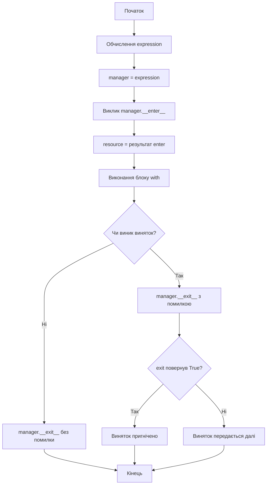

## Візуальна модель виконання (`with`)

```mermaid
flowchart TD
    A[Початок] --> B[Обчислення expression]
    B --> C[manager = expression]

    C --> D["Виклик manager.__enter__"]
    D --> E["resource = результат enter"]

    E --> F[Виконання блоку with]

    F --> G{Чи виник виняток?}

    G -- Ні --> H["manager.__exit__ без помилки"]
    G -- Так --> I["manager.__exit__ з помилкою"]

    I --> J{exit повернув True?}

    J -- Так --> K[Виняток пригнічено]
    J -- Ні --> L[Виняток передається далі]

    H --> M[Кінець]
    K --> M
    L --> M
```

---