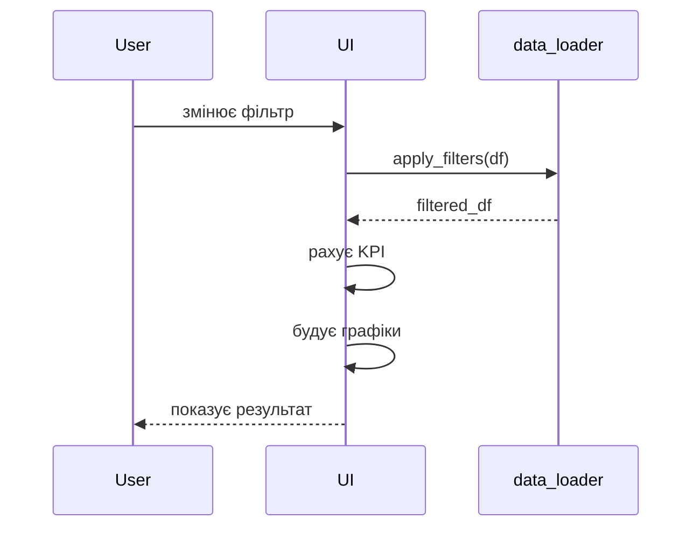

# 🛒 ShopHub — Архітектура простого e-commerce додатку

**Module 2 · Фінальний проєкт (спрощена версія)**

---

## 1 · Головна ідея

Це не “аналітичний engine”.

Це:

> **простий сайт каталогу товарів з фільтрами і базовою аналітикою**

---

## 2 · Потік даних (Flow)

```mermaid
flowchart TD

    CSV["📁 amazon_ecommerce_1M.csv\n1M рядків"]

    DL["data_loader.py\nload_catalog()"]

    FILTER["apply_filters()\nфільтрація"]

    AGG["groupby / mean / count\nагрегації"]

    UI["app.py\nStreamlit UI"]

    CSV --> DL
    DL --> FILTER
    FILTER --> AGG
    FILTER --> UI
    AGG --> UI
````

---

## 3 · Структура файлів

```text
ecommerce_analytics/

├── app.py          ← UI (Streamlit)
├── data_loader.py  ← робота з даними
└── amazon_ecommerce_1M.csv ← дані
```

---

## 4 · Ролі файлів

### 📄 data_loader.py

Відповідає тільки за дані

Функції:

* `load_catalog()` → читає CSV
* `apply_filters()` → фільтрує дані
* `top_brands()` → допоміжна аналітика

👉 тут вся логіка роботи з pandas
👉 UI сюди не лізе


---

### 📄 app.py

Відповідає тільки за відображення

Що робить:

* викликає `load_catalog()`
* отримує `df`
* передає у `apply_filters()`
* показує:

  * KPI
  * таблицю товарів
  * графіки

👉 не містить складної логіки
👉 тільки виклики функцій


---

## 5 · Архітектурний принцип

```text
data → functions → UI
```

---

## 6 · Чому тут НЕ потрібні класи

Цей проєкт:

* не має складного стану
* не має складної бізнес-логіки
* працює як pipeline обробки даних

👉 тому використовуємо:

```text
функції замість класів
```

---

## 7 · Обробка 1M рядків

Проблема:
1M рядків не можна просто вивести в UI

Рішення:

```text
CSV
↓
usecols (менше колонок)
↓
@st.cache_data (читання 1 раз)
↓
apply_filters (звуження)
↓
head(150) (UI)
↓
groupby (агрегати)
```

---

## 8 · Рівні системи

### Рівень 1 — Дані

* CSV файл

---

### Рівень 2 — Логіка (functions)

* load_catalog
* apply_filters
* top_brands

---

### Рівень 3 — UI

* Streamlit
* KPI
* таблиці
* графіки

---

## 9 · Як працює один запит



---

## 10 · Головний інсайт

> ❗ Це не “архітектура заради архітектури”

Це:

```text
простий продукт → чиста логіка → зрозумілий код
```

---

## 11 · Зв'язок з Module 2

Цей проєкт показує:

| Концепція                   | Де                            |
| --------------------------- | ----------------------------- |
| Функції                     | `apply_filters`, `top_brands` |
| Функції як об'єкти          | можна передати у списках      |
| Чисті функції               | df → df                       |
| Розділення відповідальності | data_loader vs app            |

---

## 12 · Як запустити


```bash
cd module_2/lessons/lesson_21_module2_review/ecommerce_analytics


streamlit run app.py
```

---


