# Діаграми — Урок 25: Алгоритми пошуку та хешування

---

## 1. Дві Фундаментальні Стратегії Пошуку

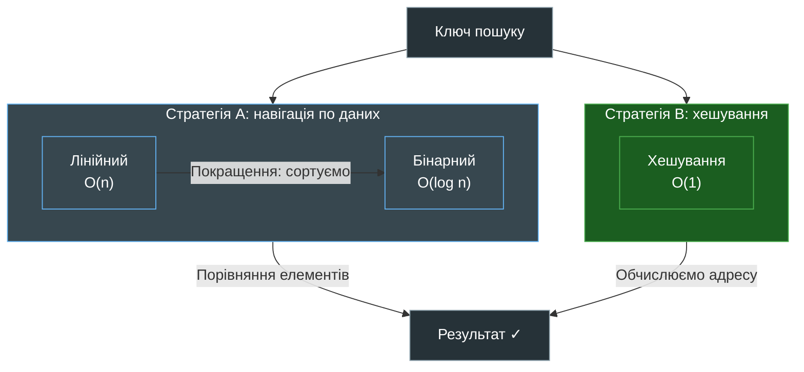

**Де використовується:**
- Лінійний: невідсортовані списки, малі об'єми
- Бінарний: відсортовані колекції, `bisect` модуль
- Хешування: `dict`, `set` — будь-який ключ → миттєво

---

## 2. Лінійний Пошук: Алгоритм O(n)

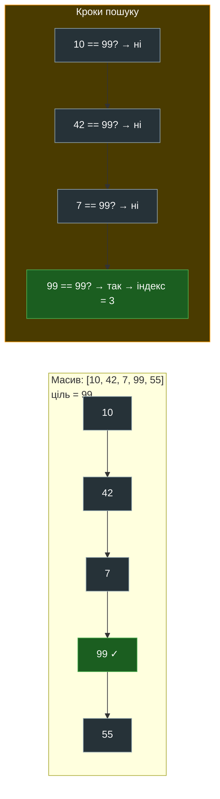

**Складність:** O(n) — у найгіршому випадку перевіряємо всі елементи

---

## 3. Бінарний Пошук: «Поділяй і Володарюй» O(log n)

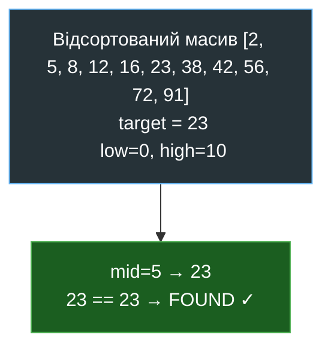

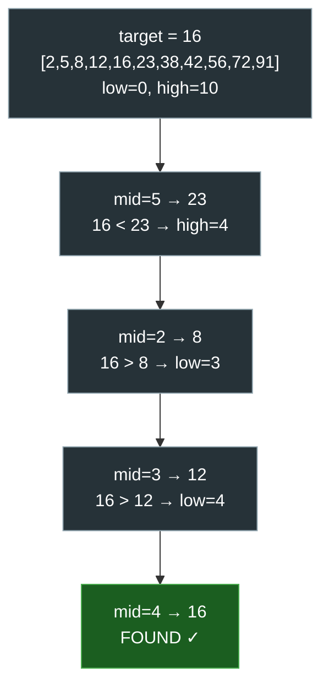
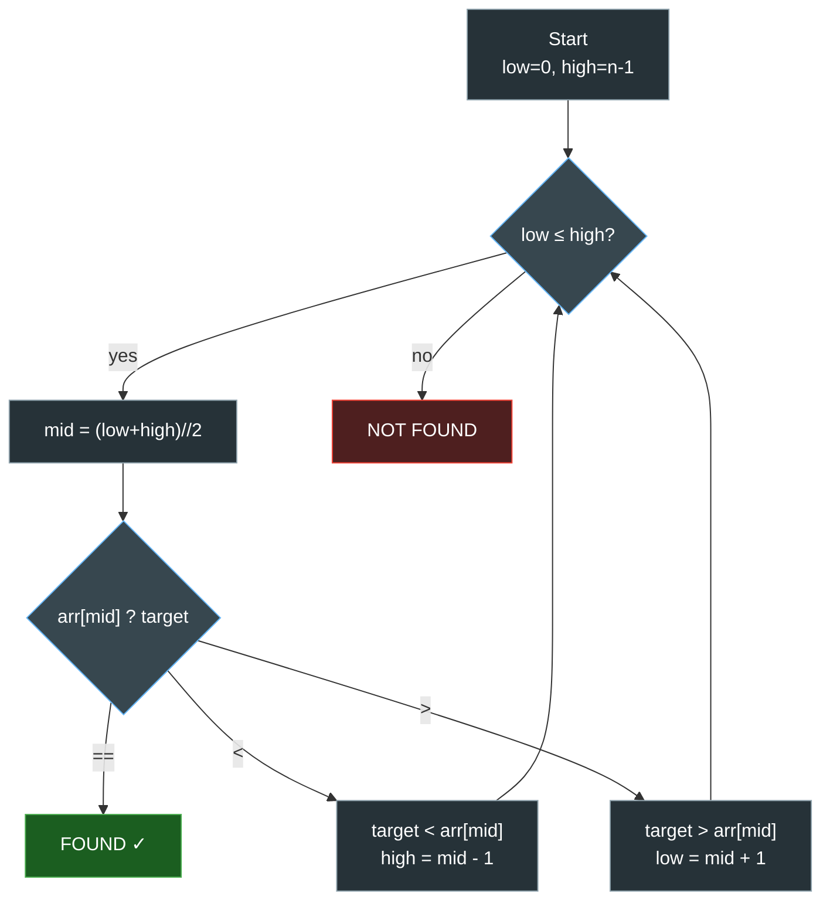


**Математика O(log n):**
```
n = 1 024 → максимум 10 кроків  (log₂(1024) = 10)
n = 1 000 000 → максимум 20 кроків
n = 1 000 000 000 → максимум 30 кроків
```

---

## 4. Архітектура Хеш-Таблиці

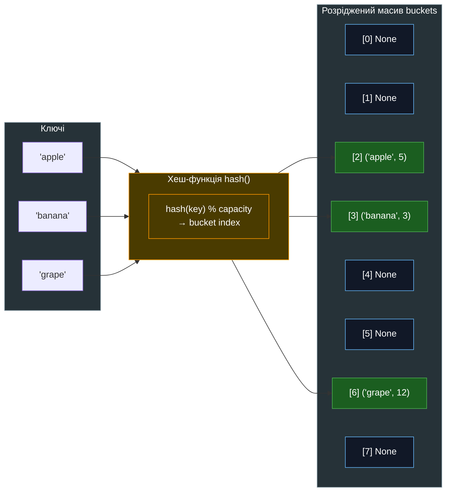

**Чому O(1)?** Ми **обчислюємо** індекс, а не **шукаємо** — один стрибок в пам'яті.

---

## 5. Внутрішній Процес Пошуку у Python `dict` (5 кроків)

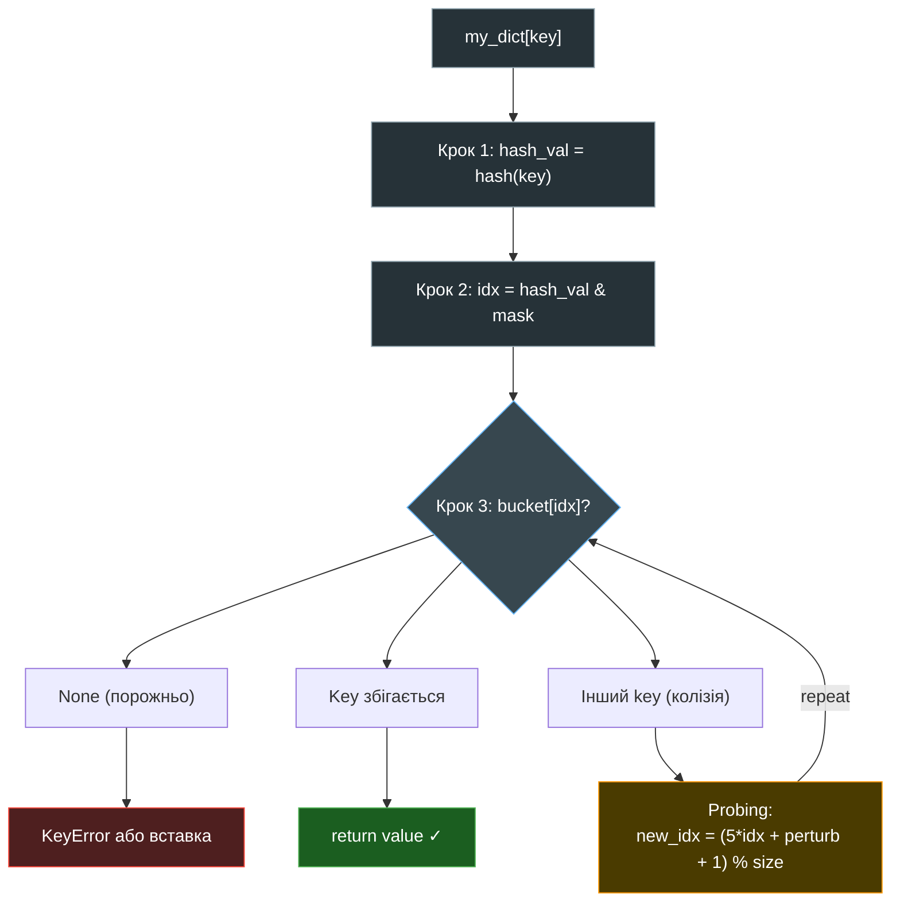

---

## 6. Колізії: Chaining vs Open Addressing

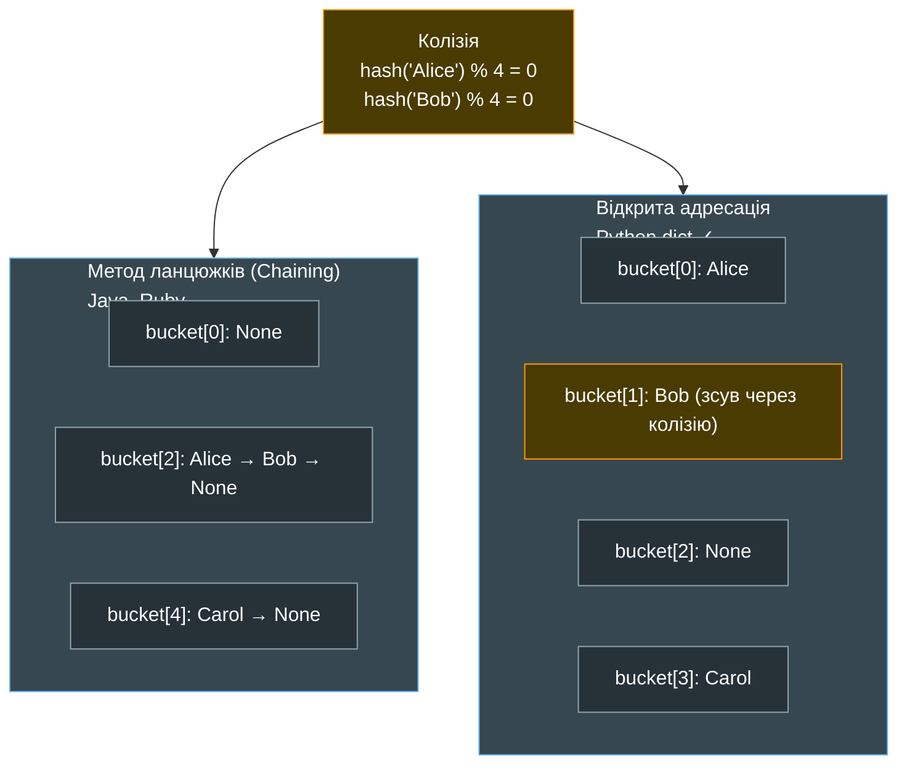

**Чому Python вибрав Open Addressing?**
- Немає накладних витрат на вказівники зв'язного списку
- Всі дані в одному суцільному масиві → CPU cache locality
- Псевдовипадкове зондування рівномірно розподіляє елементи

---

## 7. Hashable: Контракт `__hash__` + `__eq__`

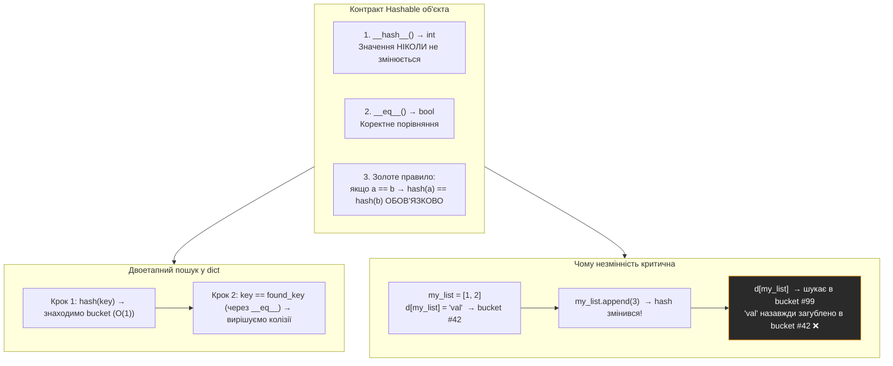

---

## 8. Компроміс: Пам'ять проти Швидкості

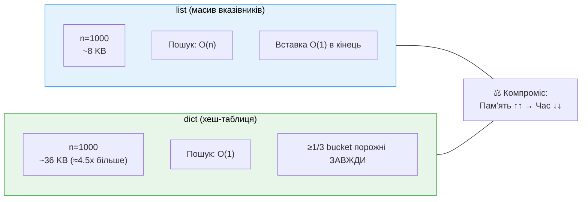

**Rehashing (перебудова таблиці):**
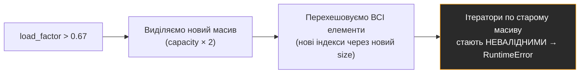

---

## 9. Алгоритм Вибору Стратегії Пошуку

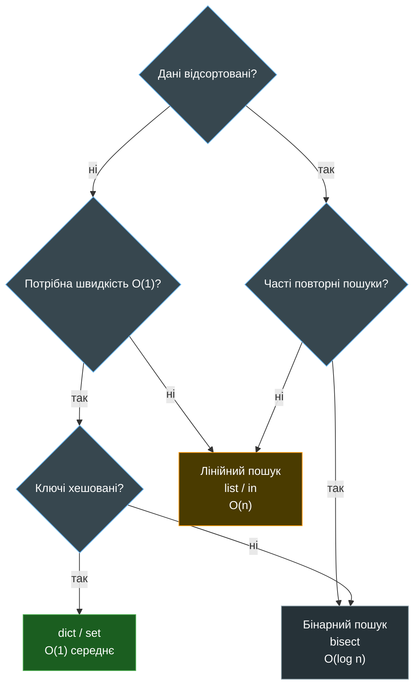

---

## 10. Порівняльна Складність: Повна Картина

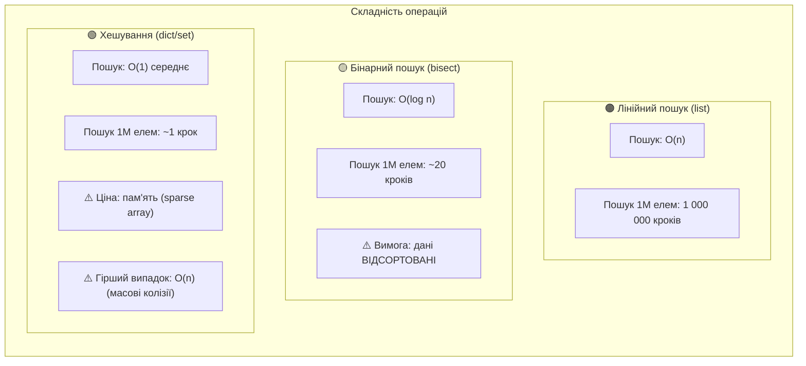

---

## 11. Python `dict`: Порядок Вставки (CPython 3.7+)

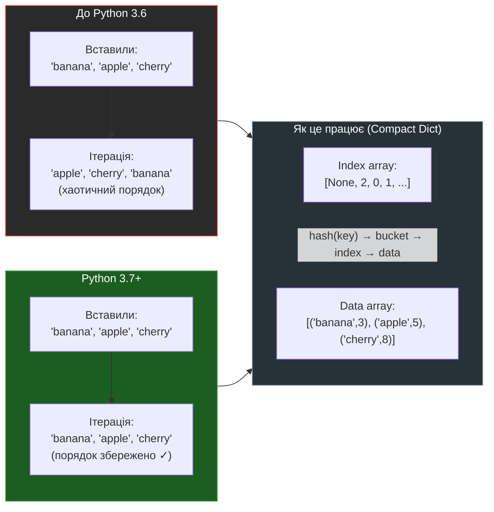

---

## 12. Реальні Застосування

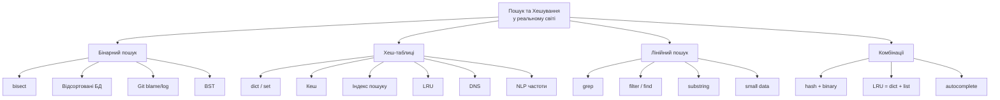

---

*Урок 25 · Module 3 · Python Advanced · Viktor Nikoriak*
