# Діаграми — Урок 26: Дерева та алгоритми дерев

---

## 1. Бінарне дерево: термінологія та структура

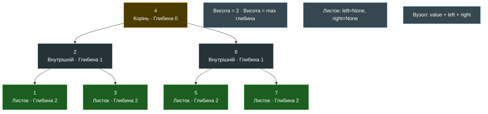

**Інваріант BST:** ліве піддерево < вузол < праве піддерево — глобально для всього дерева!

---

## 2. Інваріант BST: локальний vs глобальний

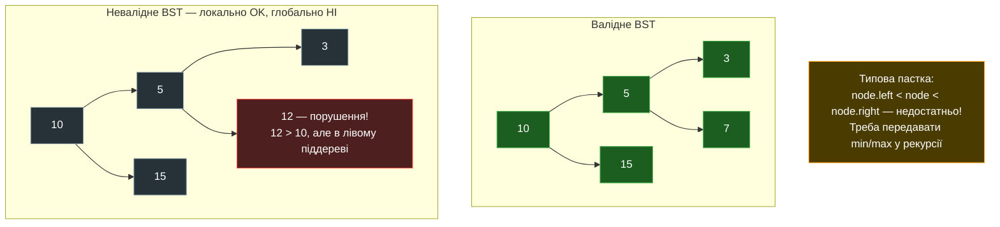

---

## 3. Три варіанти DFS: Pre-order, In-order, Post-order

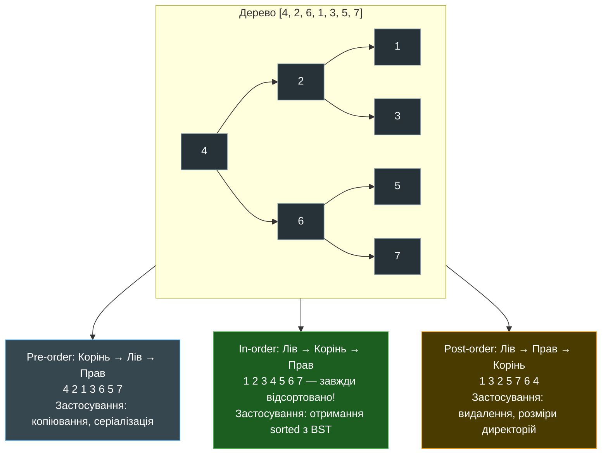

---

## 4. BFS vs DFS: Черга проти Стеку

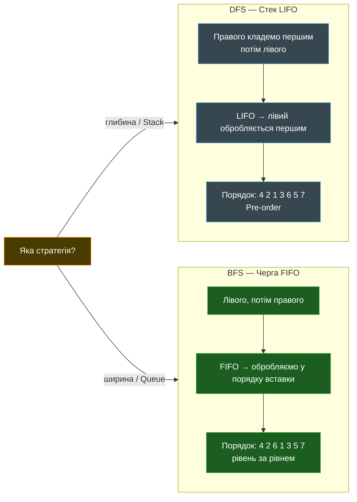

---

## 5. BFS покроково: Queue (FIFO)

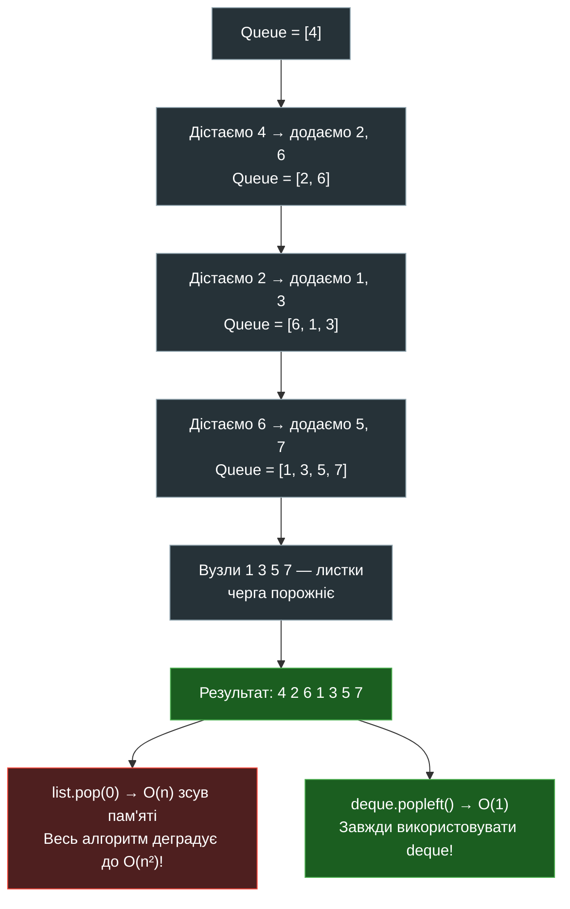

---

## 6. DFS Pre-order покроково: Stack (LIFO)

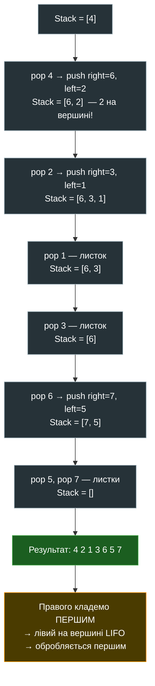

---

## 7. Рекурсія vs Ітерація: де зберігається стан

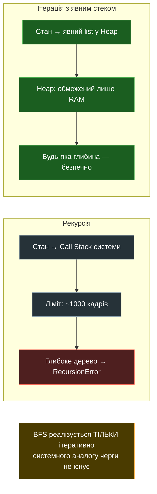

---

## 8. Збалансоване vs Вироджене дерево

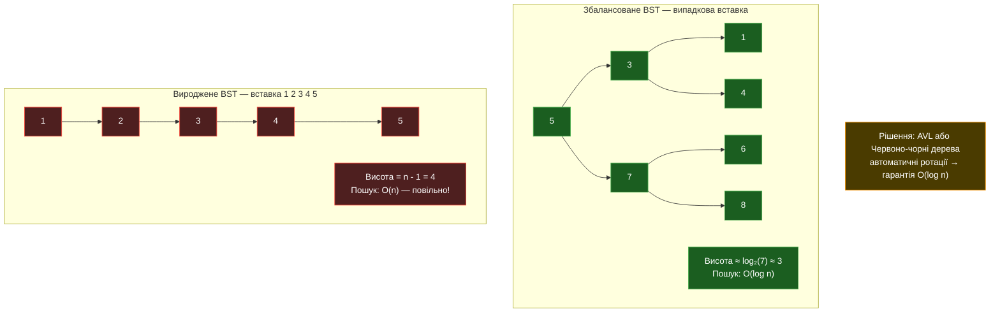

---

## 9. BST vs Хеш-таблиця: порівняння

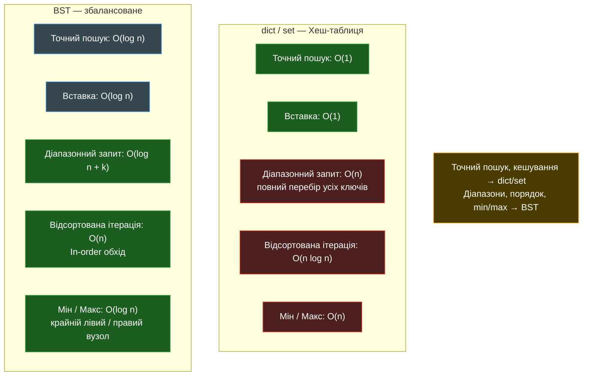

---

## 10. Алгоритм вибору обходу

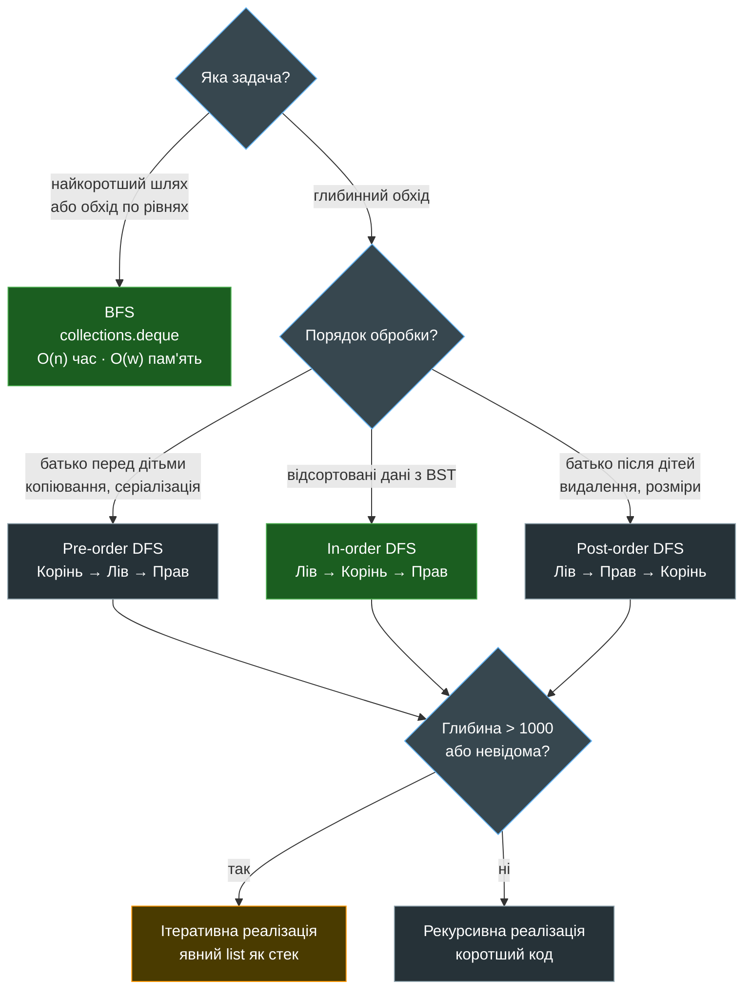

---

## 11. Серіалізація дерева через Pre-order

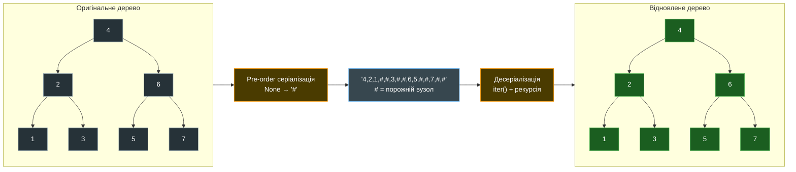

---

## 12. Реальні застосування дерев

```mermaid
flowchart TD
    classDef step fill:#263238,stroke:#90a4ae,color:#ffffff;
    classDef success fill:#1b5e20,stroke:#4CAF50,color:#ffffff;
    classDef decision fill:#37474f,stroke:#64b5f6,color:#ffffff;
    classDef warning fill:#4a3b00,stroke:#ff9800,color:#ffffff;

    ROOT["Дерева у реальному світі"]

    ROOT --> FS["Файлова система"]
    ROOT --> DOM["HTML DOM"]
    ROOT --> DB["Бази даних"]
    ROOT --> COMP["Компілятори"]
    ROOT --> SEARCH["Пошукові системи"]

    FS --> FS1["Директорія = внутрішній вузол"]
    FS --> FS2["Файл = листок"]
    FS --> FS3["find / du = Post-order DFS"]

    DOM --> DOM1["html = корінь"]
    DOM --> DOM2["CSS-специфічність = LCA"]
    DOM --> DOM3["querySelector = DFS"]

    DB --> DB1["B-tree індекси PostgreSQL / MySQL"]
    DB --> DB2["O(log n) серед мільярдів рядків"]
    DB --> DB3["Вузол = сотні нащадків"]

    COMP --> COMP1["AST — абстрактне синтаксичне дерево"]
    COMP --> COMP2["2+3×4 → Post-order обчислення"]

    SEARCH --> SR1["Trie — автодоповнення"]
    SEARCH --> SR2["Prefix search O(L)"]

    class ROOT warning
    class FS,DOM,DB,COMP,SEARCH decision
    class FS1,FS2,DOM1,COMP1,SR1,DB1 step
    class FS3,DOM2,DOM3,DB2,DB3,COMP2,SR2 success
```

---

*Урок 26 · Module 3 · Python Advanced · Viktor Nikoriak*
