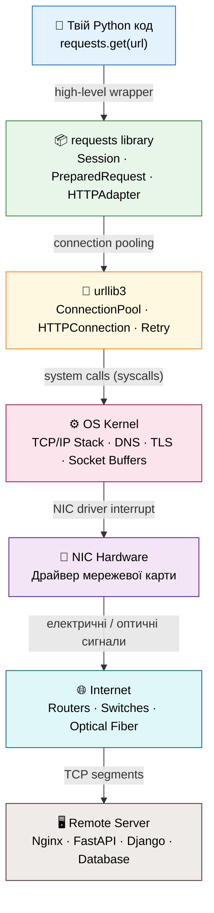
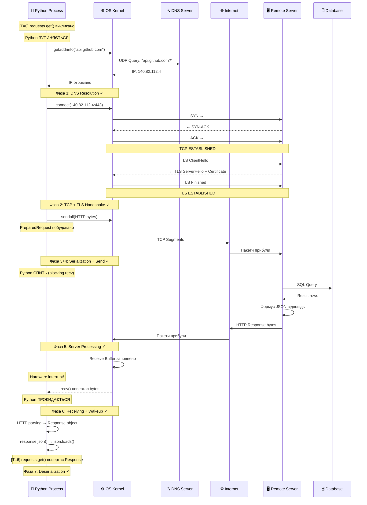
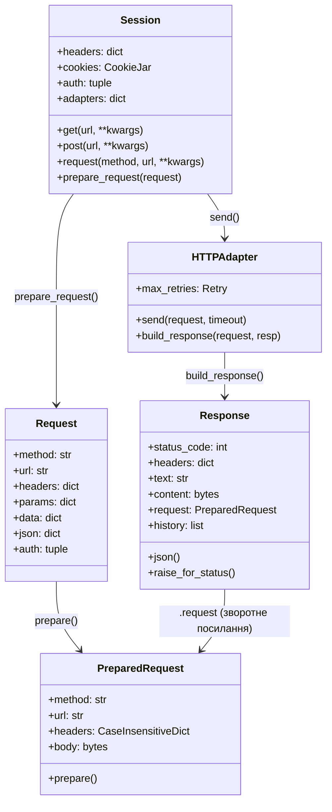
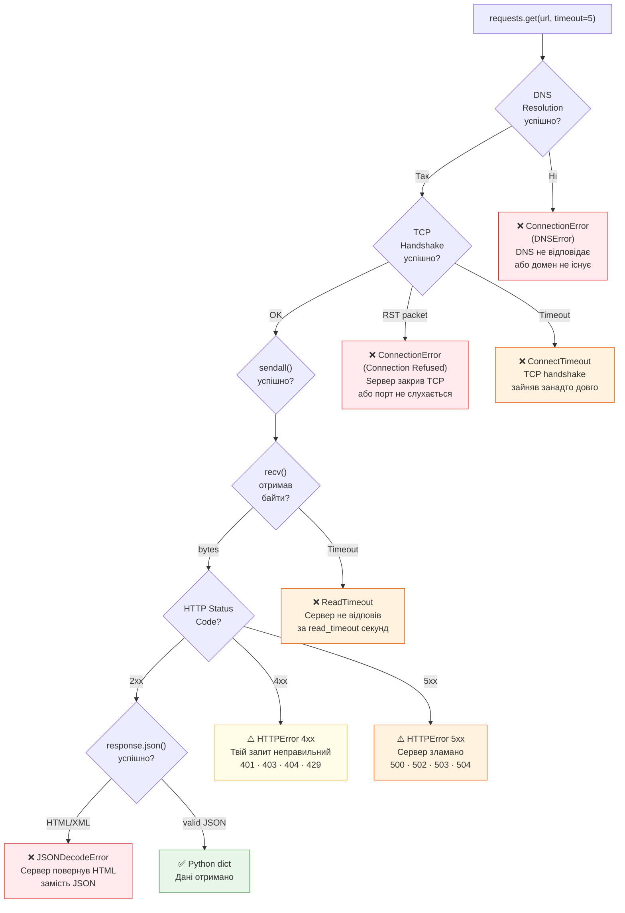
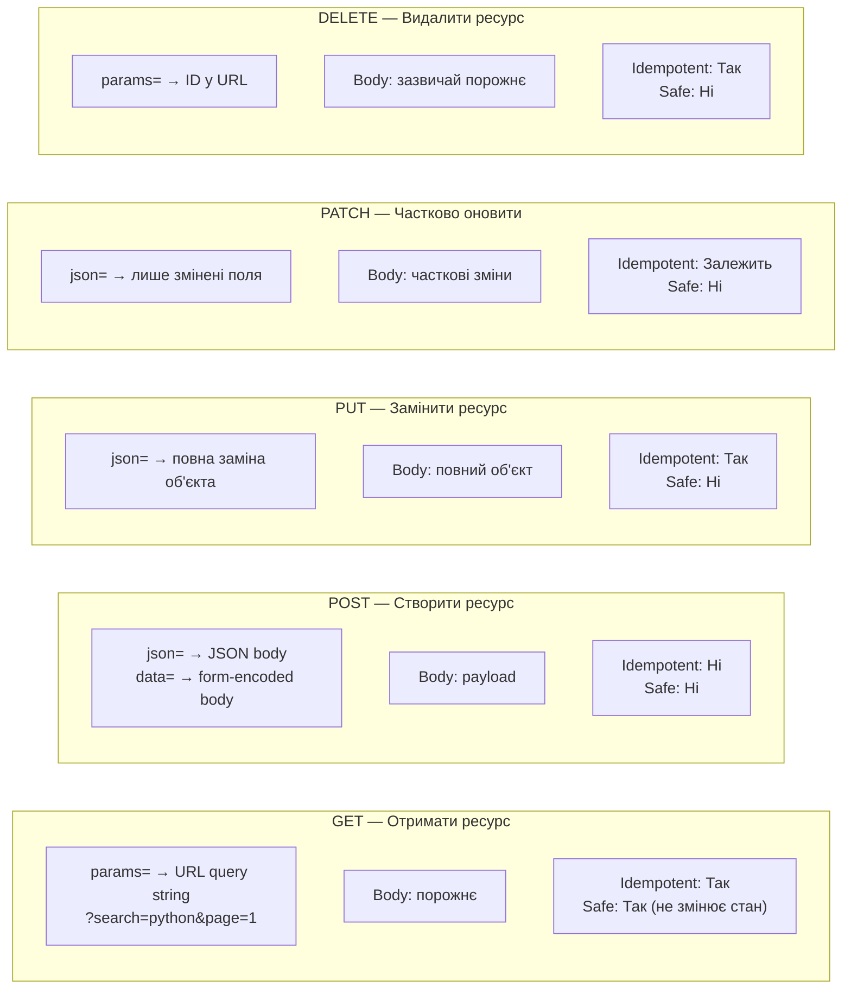
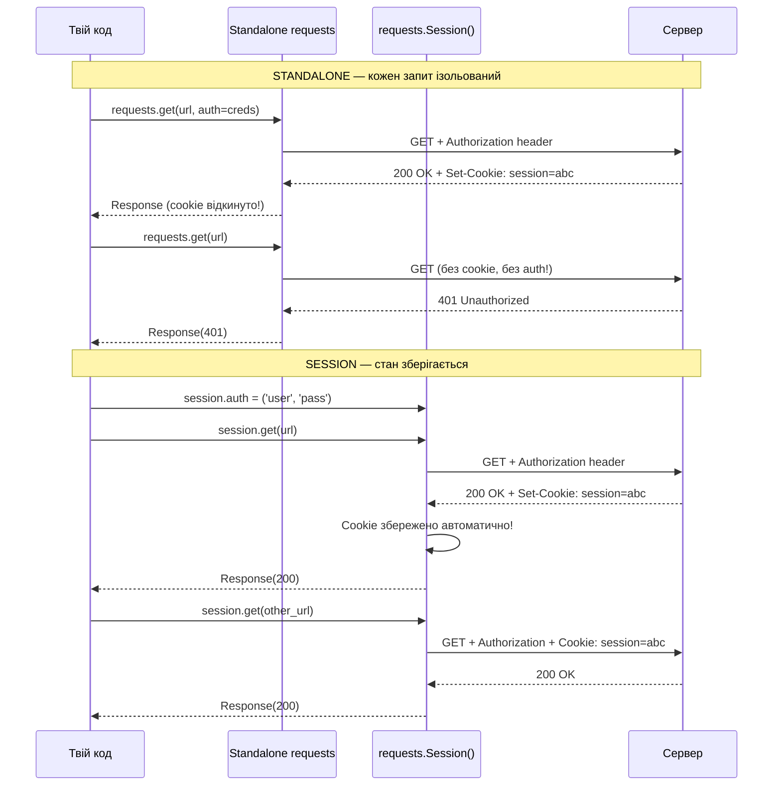
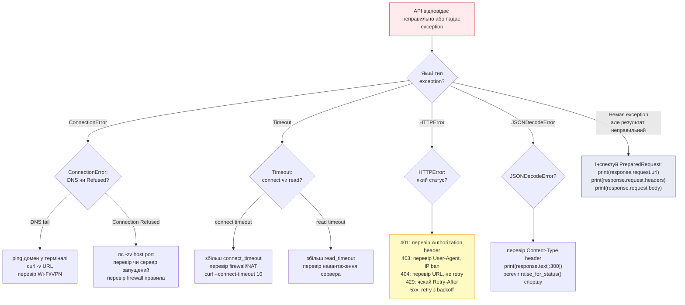

# Урок 31 — HTTP Requests: Документація та Архітектурні Схеми

**Модуль 4 · Network & Concurrent Systems**

> Цей файл — довідник та архітектурний компаньйон до `note_lesson_31_http_requests.ipynb`.
> Містить Mermaid-схеми, глибокі пояснення та production patterns.

---

## Зміст

1. [Що таке HTTP](#1-що-таке-http)
2. [Шари мережевого стеку](#2-шари-мережевого-стеку)
3. [7 Фаз HTTP-запиту](#3-7-фаз-http-запиту)
4. [requests: Внутрішня архітектура](#4-requests-внутрішня-архітектура)
5. [Типи помилок та їх джерела](#5-типи-помилок-та-їх-джерела)
6. [HTTP Methods та семантика](#6-http-methods-та-семантика)
7. [Session vs Standalone Requests](#7-session-vs-standalone-requests)
8. [Production Patterns](#8-production-patterns)
9. [Debugging Flowchart](#9-debugging-flowchart)

---

## 1. Що таке HTTP

### Визначення

HTTP (HyperText Transfer Protocol) — текстовий протокол прикладного рівня (L7),
що визначає формат запитів і відповідей між клієнтом і сервером.

### Ключові властивості

| Властивість | Пояснення |
| ----------- | --------- |
| **Stateless** | Сервер не пам'ятає попередніх запитів |
| **Text-based** | Повідомлення — це відформатований ASCII текст |
| **Request-Response** | Клієнт завжди ініціює, сервер відповідає |
| **TCP-based** | Працює поверх TCP (надійна доставка) |
| **Layered** | HTTP не знає про TCP деталі; TCP не знає про HTTP |

### Анатомія HTTP Request

```
GET /users/octocat HTTP/1.1\r\n         ← Request Line
Host: api.github.com\r\n                 ← Headers (конверт)
User-Agent: python-requests/2.28.1\r\n
Authorization: Bearer token123\r\n
Accept: application/json\r\n
\r\n                                     ← Порожній рядок = кінець headers
                                         ← Body (для GET — порожнє)
```

### Анатомія HTTP Response

```
HTTP/1.1 200 OK\r\n                      ← Status Line
Content-Type: application/json\r\n       ← Headers
Content-Length: 135\r\n
X-RateLimit-Remaining: 59\r\n
\r\n                                     ← Порожній рядок
{"login": "octocat", "id": 1, ...}       ← Body (JSON)
```

---

## 2. Шари Мережевого Стеку



**Ключовий принцип:** Python працює лише на рівні A і частково B.
Все нижче — OS Kernel і hardware. `requests` ховає цю складність,
але при помилках вона "протікає" назад до тебе як exception.

---

## 3. 7 Фаз HTTP-запиту

### Sequence Diagram: Повний Lifecycle



### Фази у деталях

| Фаза | Час | Де Python | Хто виконує роботу |
| ---- | --- | --------- | ------------------- |
| DNS Resolution | T=0 | Зупинений | OS Kernel → DNS Server |
| TCP + TLS Handshake | T=1 | Зупинений | OS Kernel ↔ Remote OS |
| HTTP Serialization | T=2 | Активний | `requests` library |
| Send + Long Sleep | T=3 | **Спить** | OS Kernel → NIC → Internet |
| Server Processing | T=4 | **Спить** | Remote Server + DB |
| Receive + Wakeup | T=5 | Прокидається | OS Kernel (interrupt) |
| Deserialization | T=6 | Активний | `json.loads()` у RAM |

---

## 4. requests: Внутрішня Архітектура



### Потік даних всередині requests

```mermaid
flowchart LR
    A["requests.get(url,\nparams=...,\nheaders=...,\njson=...,\ntimeout=...)"]

    B["Request об'єкт\n(непідготовлений)"]

    C["PreparedRequest\nmethod='GET'\nurl='https://...?q=python'\nheaders={...}\nbody=b'{...}'"]

    D["HTTPAdapter.send()\nurllib3\nConnectionPool"]

    E["OS Socket\nsendall() + recv()"]

    F["HTTP Response bytes\nHTTP/1.1 200 OK\n..."]

    G["Response об'єкт\n.status_code=200\n.headers={...}\n.text='...'"]

    A -->|"Session.request()"| B
    B -->|"prepare_request()"| C
    C -->|"adapter.send()"| D
    D -->|"socket syscall"| E
    E -->|"raw bytes"| F
    F -->|"build_response()"| G

    style C fill:#fff3e0,stroke:#e65100
    style E fill:#fce4ec,stroke:#880e4f
```



---

## 5. Типи Помилок та їх Джерела



### Таблиця Exception → Причина → Дія

| Exception | Рівень | Причина | Дія |
| --------- | ------ | ------- | --- |
| `ConnectionError` (DNS) | L3-L4 | Домен не знайдено | Перевір DNS: `ping domain.com` |
| `ConnectionError` (Refused) | L4 | Порт закрито, RST | Перевір чи сервер запущено |
| `ConnectTimeout` | L4 | Handshake завис | Збільш connect_timeout або перевір firewall |
| `ReadTimeout` | L7 | Сервер повільний | Збільш read_timeout або retry |
| `SSLError` | L4-L7 | Невалідний сертифікат | Оновити CA bundle або `verify=False` (небезпечно!) |
| `HTTPError 401` | L7 | Немає авторизації | Додай `Authorization` header |
| `HTTPError 403` | L7 | Заблоковано (WAF/bot) | Перевір `User-Agent`, IP ban |
| `HTTPError 404` | L7 | Ресурс не існує | Перевір URL, не retry |
| `HTTPError 429` | L7 | Rate limit | Чекай `Retry-After` секунд |
| `HTTPError 5xx` | L7 | Сервер зламаний | Retry з backoff |
| `JSONDecodeError` | Python | HTML замість JSON | Перевір `Content-Type` header |
| `TooManyRedirects` | L7 | Redirect loop | `allow_redirects=False`, перевір URL |

---

## 6. HTTP Methods та Семантика



### Де йдуть дані — чіткий порівняльник

| Kwargs | HTTP частина | Метод | Приклад |
| ------ | ------------ | ----- | ------- |
| `params={'q': 'py'}` | URL: `?q=py` | GET | пошук, фільтрація |
| `headers={'Auth': '...'}` | HTTP Headers | будь-який | токени, content-type |
| `data={'key': 'val'}` | Body (form-encoded) | POST | HTML форми |
| `json={'key': 'val'}` | Body (JSON) | POST/PUT/PATCH | REST API |
| `files={'file': ...}` | Body (multipart) | POST | завантаження файлів |
| `auth=('user','pass')` | Authorization header | будь-який | Basic Auth |

---

## 7. Session vs Standalone Requests



### Що Session зберігає між запитами

```python
session = requests.Session()
session.headers['User-Agent'] = 'MyApp/1.0'     # всі запити матимуть цей User-Agent
session.auth = ('user', 'pass')                  # Basic Auth у кожному запиті
session.cookies.set('tracking', 'value')         # cookie у кожному запиті
session.verify = False                           # вимкнути SSL verify (небезпечно!)
```

---

## 8. Production Patterns

### 8.1. Базовий Production Pattern

```python
import requests
from typing import Any

def safe_api_call(
    url: str,
    method: str = 'GET',
    **kwargs: Any
) -> dict:
    """
    Production-grade HTTP запит із повною обробкою помилок.
    """
    kwargs.setdefault('timeout', (3.05, 10))

    try:
        response = requests.request(method, url, **kwargs)
        response.raise_for_status()
        return response.json()

    except requests.exceptions.ConnectTimeout:
        raise RuntimeError(f"TCP handshake timeout: {url}")

    except requests.exceptions.ReadTimeout:
        raise RuntimeError(f"Server response timeout: {url}")

    except requests.exceptions.ConnectionError as e:
        raise RuntimeError(f"Network unreachable (DNS/TCP): {e}")

    except requests.exceptions.HTTPError as e:
        status = e.response.status_code
        body = e.response.text[:500]
        raise RuntimeError(f"HTTP {status} from {url}: {body}")

    except ValueError:
        raise RuntimeError(f"Invalid JSON from {url}: {response.text[:200]}")
```

### 8.2. Session з Retry та Backoff

```python
import requests
from requests.adapters import HTTPAdapter
from urllib3.util.retry import Retry


def build_session(
    retries: int = 3,
    backoff_factor: float = 1.0,
    base_url: str = '',
    token: str = '',
) -> requests.Session:
    """
    Production session із retry, backoff та авторизацією.
    """
    retry_strategy = Retry(
        total=retries,
        backoff_factor=backoff_factor,   # 1с → 2с → 4с між спробами
        status_forcelist=[429, 500, 502, 503, 504],
        allowed_methods=['GET', 'POST', 'PUT'],
        respect_retry_after_header=True,
    )

    adapter = HTTPAdapter(max_retries=retry_strategy)

    session = requests.Session()
    session.mount('https://', adapter)
    session.mount('http://', adapter)

    if base_url:
        session.headers['X-Base-URL'] = base_url

    if token:
        session.headers['Authorization'] = f'Bearer {token}'

    return session


# Використання
session = build_session(
    retries=3,
    backoff_factor=1.0,
    token='my_api_token_here'
)

response = session.get(
    'https://httpbin.org/get',
    params={'q': 'python'},
    timeout=(3.05, 10)
)
response.raise_for_status()
data = response.json()
```

### 8.3. Debugging Helper

```python
import requests

def inspect_request(response: requests.Response) -> None:
    """Повна діагностика відправленого запиту та отриманої відповіді."""

    req = response.request

    print("── ВІДПРАВЛЕНО ──────────────────────")
    print(f"  {req.method} {req.url}")
    for k, v in req.headers.items():
        print(f"  {k}: {v}")
    if req.body:
        print(f"\n  Body: {req.body[:200]}")

    print("\n── ОТРИМАНО ─────────────────────────")
    print(f"  HTTP {response.status_code} {response.reason}")
    for k, v in response.headers.items():
        print(f"  {k}: {v}")
    print(f"\n  Body (перші 300 символів):")
    print(f"  {response.text[:300]}")

    if response.history:
        print(f"\n── РЕДИРЕКТИ ({len(response.history)}) ────────────")
        for r in response.history:
            print(f"  {r.status_code} → {r.headers.get('Location')}")
```

---

## 9. Debugging Flowchart



### Загальний Debug Checklist

```
Крок 1: Перевір status_code
    → 2xx? Продовжуй
    → 4xx? Твій запит неправильний
    → 5xx? Сервер зламаний, retry

Крок 2: Перевір Content-Type
    → application/json? Можна response.json()
    → text/html? Сервер повернув HTML сторінку помилки

Крок 3: Перегляни перші 300 символів тіла
    → response.text[:300]

Крок 4: Перевір що Python відправив
    → response.request.url
    → response.request.headers
    → response.request.body

Крок 5: Обійди Python
    → curl -v "https://..." у терміналі
    → ping domain.com
    → telnet host port
```

---

## Глосарій

| Термін | Визначення |
| ------ | ---------- |
| **HTTP** | HyperText Transfer Protocol — текстовий протокол L7 |
| **Stateless** | Кожен запит ізольований; сервер не пам'ятає попередніх |
| **TCP Handshake** | 3-way (SYN-SYN/ACK-ACK) встановлення з'єднання |
| **TLS** | Transport Layer Security — шифрування HTTPS |
| **DNS** | Domain Name System — конвертація домену в IP |
| **PreparedRequest** | Внутрішній об'єкт requests: готовий HTTP рядок байтів |
| **Blocking I/O** | `recv()` зупиняє Python process до отримання відповіді |
| **Serialization** | Python dict → JSON рядок → bytes |
| **Deserialization** | bytes → JSON рядок → Python dict |
| **Timeout tuple** | `(connect_timeout, read_timeout)` у секундах |
| **raise_for_status()** | Кидає `HTTPError` якщо status_code >= 400 |
| **Session** | Об'єкт що зберігає headers/cookies/auth між запитами |
| **Retry / Backoff** | Повторні спроби із зростаючою паузою між ними |
| **Rate Limiting** | Сервер обмежує кількість запитів (429 Too Many Requests) |
| **Thundering Herd** | Всі retry запуститись одночасно → перевантаження сервера |
| **Circuit Breaker** | Патерн: після N помилок — одразу fail, не retry |

---

*Документація до Уроку 31 · Модуль 4 · Python Networking Course*
