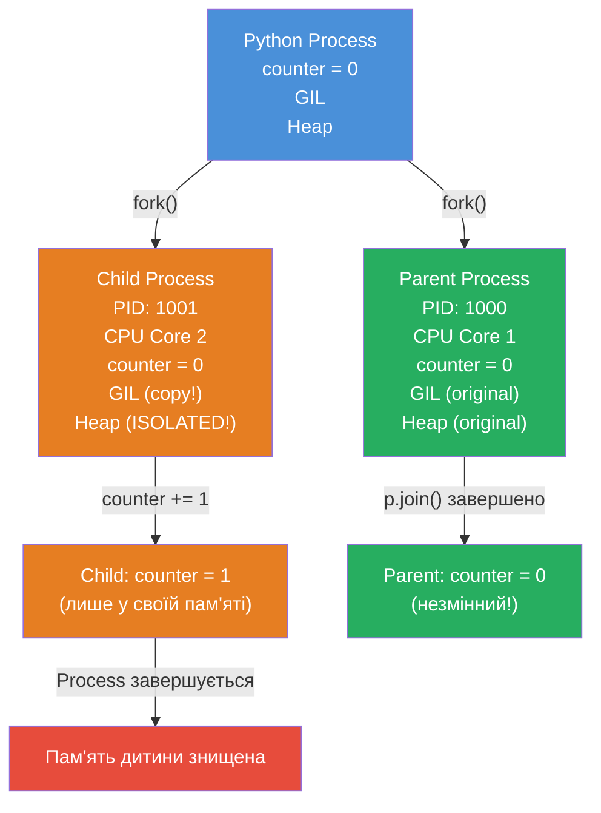
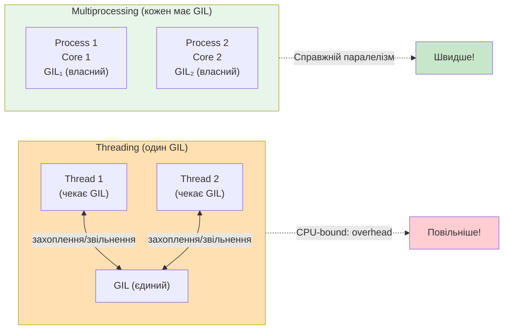
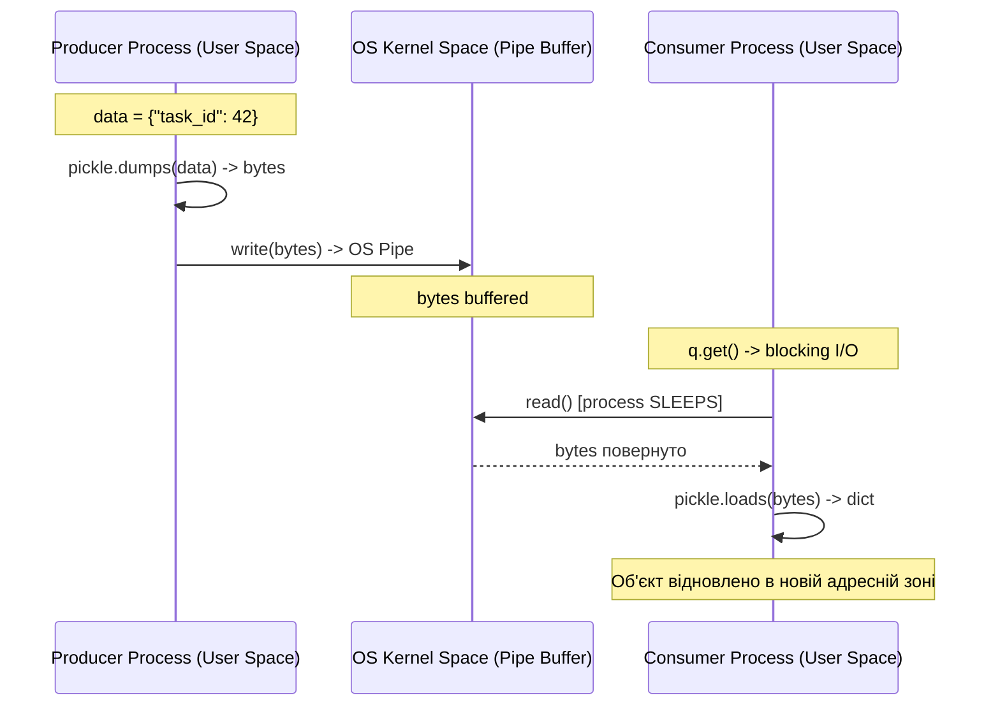
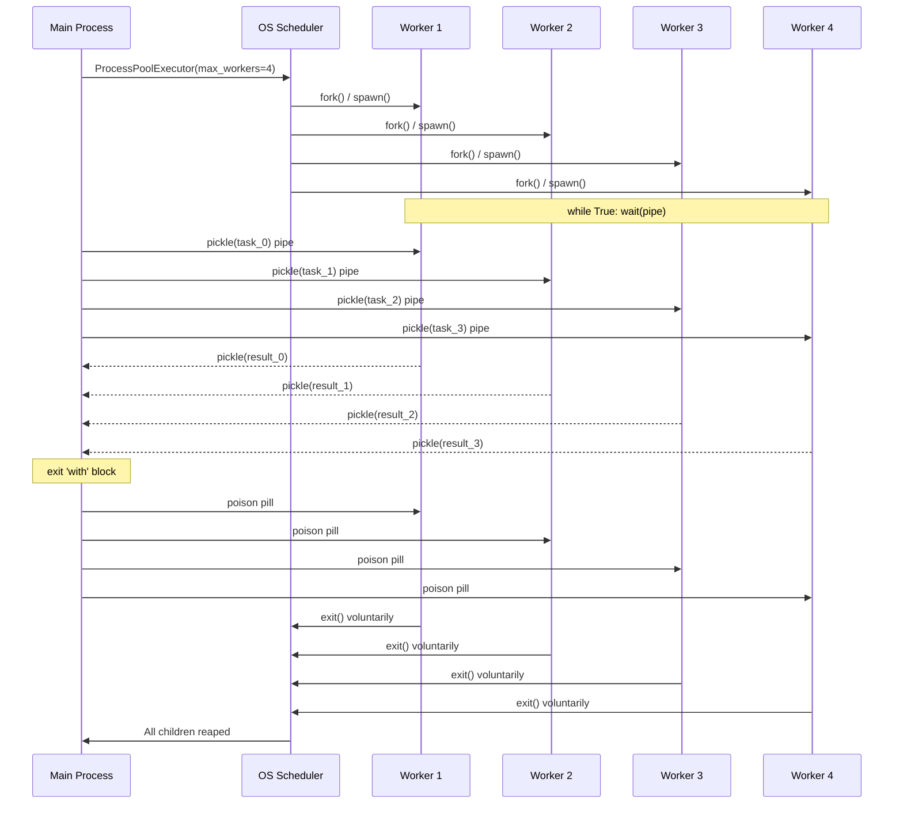
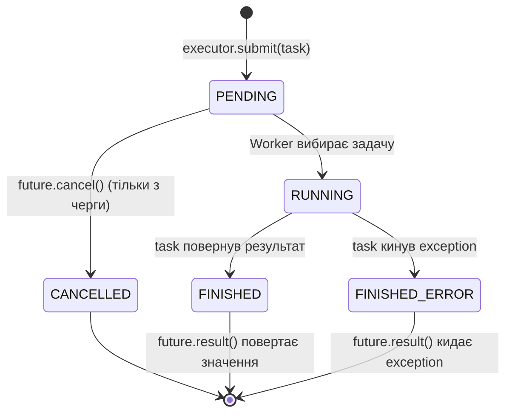
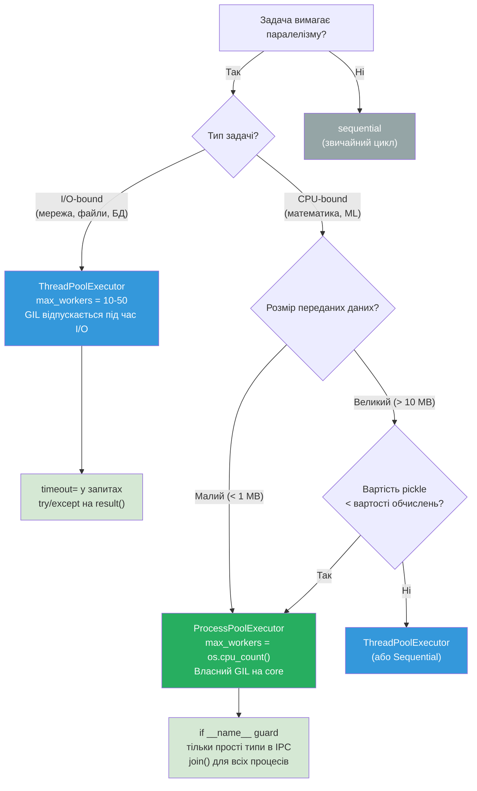
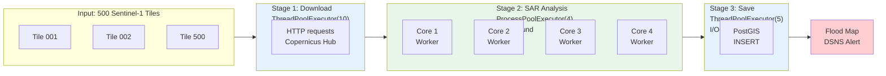
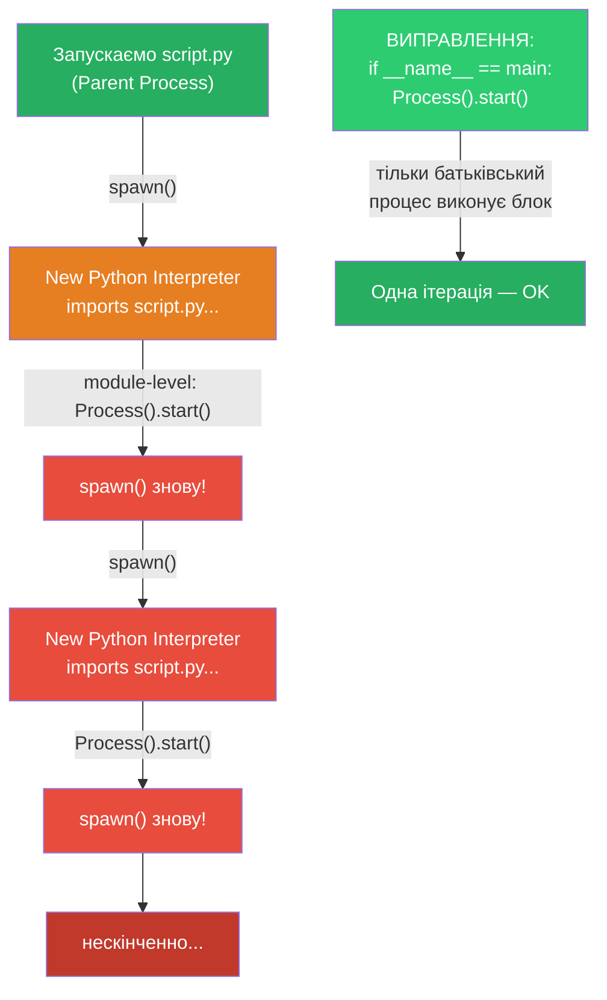

# Урок 33 — Multiprocessing: Справжній Паралелізм та Executor Architecture

**Модуль:** 4 — Network & Concurrent Systems  
**Складність:** intermediate  
**Мова:** Українська  
**Попередній урок:** Урок 32 — Threading & Concurrency  
**Наступний урок:** Урок 34 — asyncio

---

## Про цей урок

Урок будується на 5 хибних уявленнях (misconceptions), які є найпоширенішими серед Python-розробників при роботі з `multiprocessing`. Кожна вправа провокує інтуїтивно неправильну відповідь, а потім пояснює реальну поведінку через призму OS-архітектури.

---

## Learning Objectives

### Conceptual Understanding
- Пояснити різницю між Thread та Process на рівні адресних просторів ОС
- Описати що відбувається коли Python викликає `fork()` vs `spawn()`
- Пояснити чому `multiprocessing` не вирішує проблему спільної пам'яті
- Описати механізм IPC (Inter-Process Communication) через OS Pipe
- Пояснити коли `multiprocessing` уповільнює програму

### Debugging Skills
- Передбачити вивід коду з ізоляцією пам'яті
- Визначити коли `pickle` призводить до `TypeError`
- Розпізнати Zombie Process та CPU Oversubscription
- Знайти причину `RuntimeError` при запуску на Windows

### Production Skills
- Правильно використовувати `ProcessPoolExecutor` для CPU-bound задач
- Використовувати `ThreadPoolExecutor` для I/O-bound задач
- Розуміти `Future` об'єкти та `as_completed()`
- Писати безпечний код з `if __name__ == '__main__':` guard

---

## Ключові концепції

### 1. Ізоляція пам'яті (Memory Isolation)

Це найважливіша концепція уроку. Коли Python викликає `multiprocessing.Process`, операційна система виконує `fork()` (Unix) або `spawn()` (Windows):

**fork() (Unix/macOS):**
- ОС миттєво дублює весь адресний простір батьківського процесу (Copy-on-Write)
- Дочірній процес отримує повну копію всіх змінних
- Зміни в дочірньому процесі НЕ видимі батьківському

**spawn() (Windows):**
- ОС запускає новий Python-інтерпретатор "з нуля"
- Імпортує target-скрипт
- Через pickle передає функцію та аргументи

**Наслідок:** глобальні змінні, змінені в дочірньому процесі, не впливають на батьківський.

### 2. GIL та CPU-bound задачі

**GIL (Global Interpreter Lock)** — м'ютекс CPython, що захищає reference counting.

Для CPU-bound задач:
- `threading` — потоки по черзі захоплюють GIL → overhead від context switch → програма **повільніша**
- `multiprocessing` — кожен процес має власний GIL → справжній паралелізм → **вдвічі швидше**

### 3. IPC та вартість серіалізації (pickle)

Оскільки процеси ізольовані, вони обмінюються даними через OS Pipe:
1. `pickle.dumps(obj)` — Python-об'єкт → байтовий потік
2. Байти записуються в OS Pipe (Kernel Space)
3. Дочірній процес отримує байти з pipe
4. `pickle.loads(bytes)` — байти → Python-об'єкт

**Критичне правило:** якщо вартість pickle+IPC перевищує вартість обчислень → `multiprocessing` ПОВІЛЬНІШИЙ.

### 4. Executor Architecture (concurrent.futures)

`concurrent.futures` надає єдиний інтерфейс для threading та multiprocessing:

```python
# Однаковий код, різна реалізація:
with ThreadPoolExecutor(max_workers=4) as executor:   # потоки
    results = list(executor.map(task, data))

with ProcessPoolExecutor(max_workers=4) as executor:  # процеси
    results = list(executor.map(task, data))
```

**Executor lifecycle:**
1. `with` відкривається → ОС створює N worker-потоків/процесів
2. `submit(task)` → задача в чергу, повертає `Future` негайно
3. Worker бере задачу, виконує
4. `with` закривається → `shutdown(wait=True)` → чекає всіх workers
5. Всі завершились → пул знищено

### 5. Future об'єкти

`Future` — проксі-об'єкт для обчислення, що не завершилось:
- `future.done()` — чи завершено
- `future.result()` — отримати результат (БЛОКУЄ main thread!)
- `future.cancel()` — скасувати (тільки якщо ще в черзі)
- `concurrent.futures.as_completed(futures)` — ітерувати по мірі готовності

**Небезпека:** Exception "заморожується" всередині Future. Якщо не викликати `future.result()` — помилка зникає назавжди.

---

## 5 Типових помилок

### Помилка 1: Missing `__name__` guard (Windows)
```python
# НЕПРАВИЛЬНО
p = Process(target=worker)
p.start()  # RuntimeError на Windows!

# ПРАВИЛЬНО
if __name__ == '__main__':
    p = Process(target=worker)
    p.start()
    p.join()
```

### Помилка 2: Pickle Error
```python
# Не можна передати в Process:
# - socket objects
# - lambda functions
# - generators
# - open file handles

# Перевірка:
import pickle
pickle.dumps(my_obj)  # якщо падає -> Process не прийме
```

### Помилка 3: Zombie Processes
```python
# НЕПРАВИЛЬНО
for i in range(100):
    p = Process(target=task)
    p.start()
    # Забули join() -> 100 zombies!

# ПРАВИЛЬНО
processes = [Process(target=task) for _ in range(100)]
for p in processes: p.start()
for p in processes: p.join()  # ОС прибирає записи
```

### Помилка 4: JoinableQueue Deadlock
```python
# НЕПРАВИЛЬНО
def worker(q):
    item = q.get()
    process(item)
    # Забули: q.task_done() -> q.join() зависне!

# ПРАВИЛЬНО
def worker(q):
    item = q.get()
    try:
        process(item)
    finally:
        q.task_done()  # Гарантовано навіть при exception
```

### Помилка 5: CPU Oversubscription
```python
# НЕПРАВИЛЬНО: 1000 процесів на 4 cores
with ProcessPoolExecutor(max_workers=1000) as ex:
    results = ex.map(cpu_task, data)

# ПРАВИЛЬНО
import os
with ProcessPoolExecutor(max_workers=os.cpu_count()) as ex:
    results = ex.map(cpu_task, data)
```

---

## Дерево рішень

```
Задача паралельна?
        |
    Так |
        +-- I/O-bound (мережа, файли, БД)?
        |         +--> ThreadPoolExecutor
        |              (GIL відпускається під час I/O)
        |
        +-- CPU-bound (математика, ML, обробка)?
                  +--> ProcessPoolExecutor
                       (власний GIL на кожен core)
                            |
                            +-- Дані прості (int, str)?  -> OK
                            +-- Дані складні (socket, lambda)? -> PickleError!
```

---

## 5 Золотих правил

1. Завжди `if __name__ == '__main__':` для multiprocessing на Windows
2. Ніколи не передавай socket/lambda/відкриті файли в Process — лише прості типи
3. Завжди `p.join()` або context manager (запобігає zombie-процесам)
4. `max_workers` для CPU-bound ≤ `os.cpu_count()`
5. Передавай мінімум даних через IPC — id замість цілого об'єкта

---

## Технологічний стек

| Модуль | Призначення |
|--------|-------------|
| `multiprocessing` | Низькорівнева робота з процесами |
| `multiprocessing.Queue` | IPC через OS Pipe |
| `multiprocessing.Value` + `Lock` | Спільна пам'ять між процесами |
| `concurrent.futures.ThreadPoolExecutor` | I/O-bound задачі |
| `concurrent.futures.ProcessPoolExecutor` | CPU-bound задачі |
| `concurrent.futures.as_completed` | Обробка результатів по мірі готовності |
| `pickle` | Серіалізація Python-об'єктів для IPC |
| `os.cpu_count()` | Визначення оптимальної кількості workers |

---

## Зв'язки з іншими уроками

- **Урок 32 (Threading):** GIL, race conditions, Lock — base для розуміння чому multiprocessing потрібен
- **Урок 34 (asyncio):** кооперативна конкурентність для I/O-bound — альтернатива threading
- **Урок 31 (HTTP Requests):** `requests.get()` блокує — ThreadPool вирішує цю проблему

---

## Keywords

`multiprocessing`, `threading`, `GIL`, `IPC`, `pickle`, `ProcessPoolExecutor`,
`ThreadPoolExecutor`, `concurrent.futures`, `Future`, `zombie-process`, `fork`,
`spawn`, `cpu-bound`, `io-bound`, `context-switch`, `OS-pipe`, `serialization`

---

# Mermaid Діаграми

## Діаграма 1: fork() — Клітинний поділ пам'яті



---

## Діаграма 2: GIL та CPU Cores — Threading vs Multiprocessing



---

## Діаграма 3: IPC Pipeline — Як дані подорожують між процесами



---

## Діаграма 4: ProcessPoolExecutor Lifecycle



---

## Діаграма 5: Future — State Machine



---

## Діаграма 6: Дерево рішень



---

## Діаграма 7: Flood Response Hybrid Pipeline Architecture



---

## Діаграма 8: Windows Spawn Bomb


