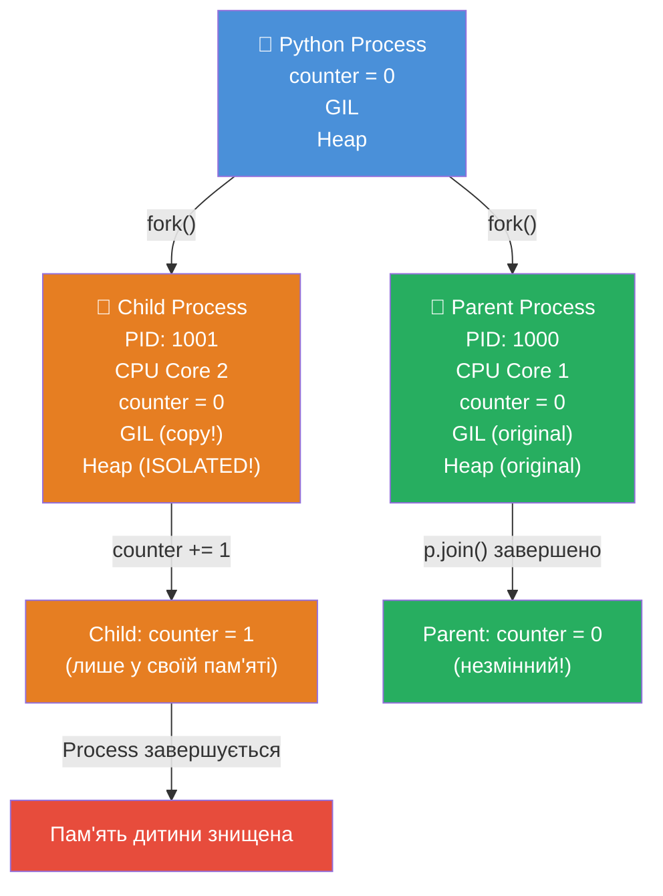
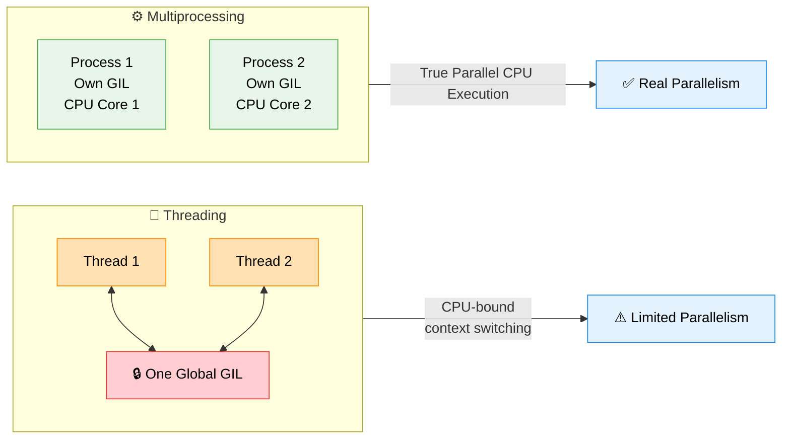
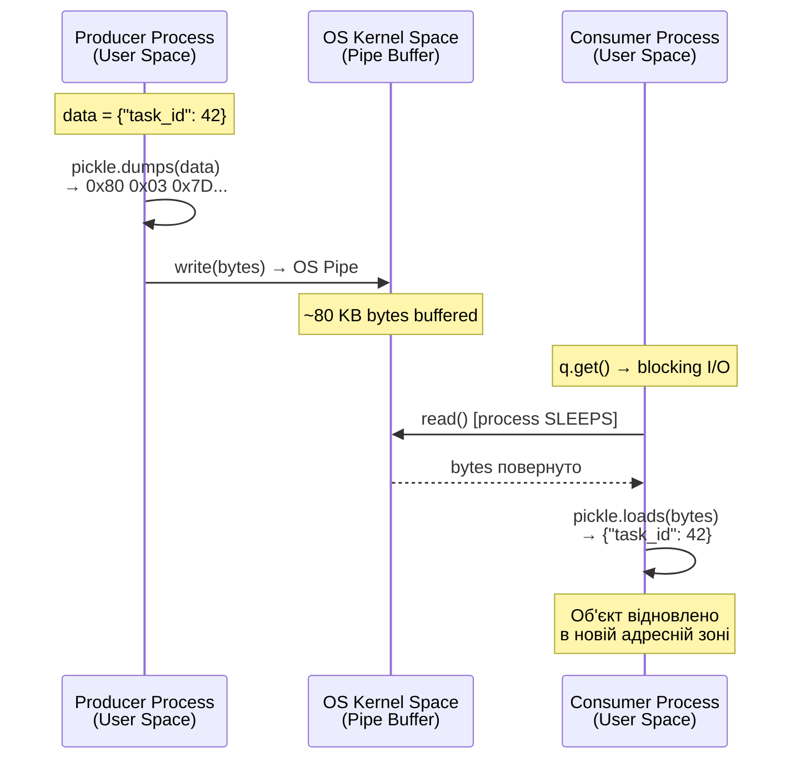
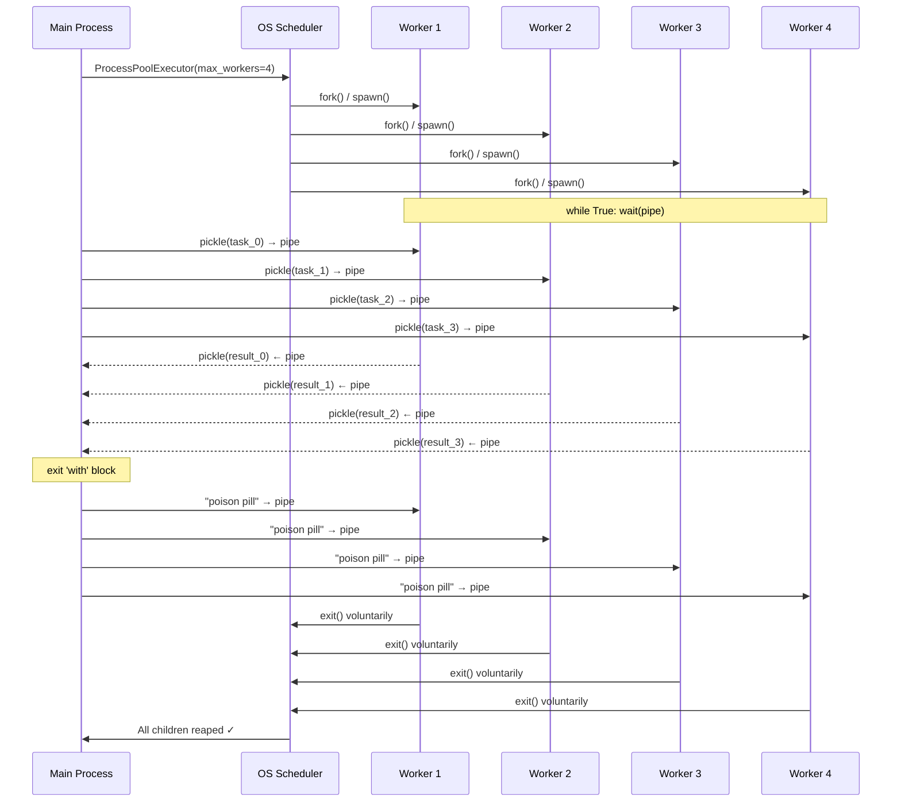
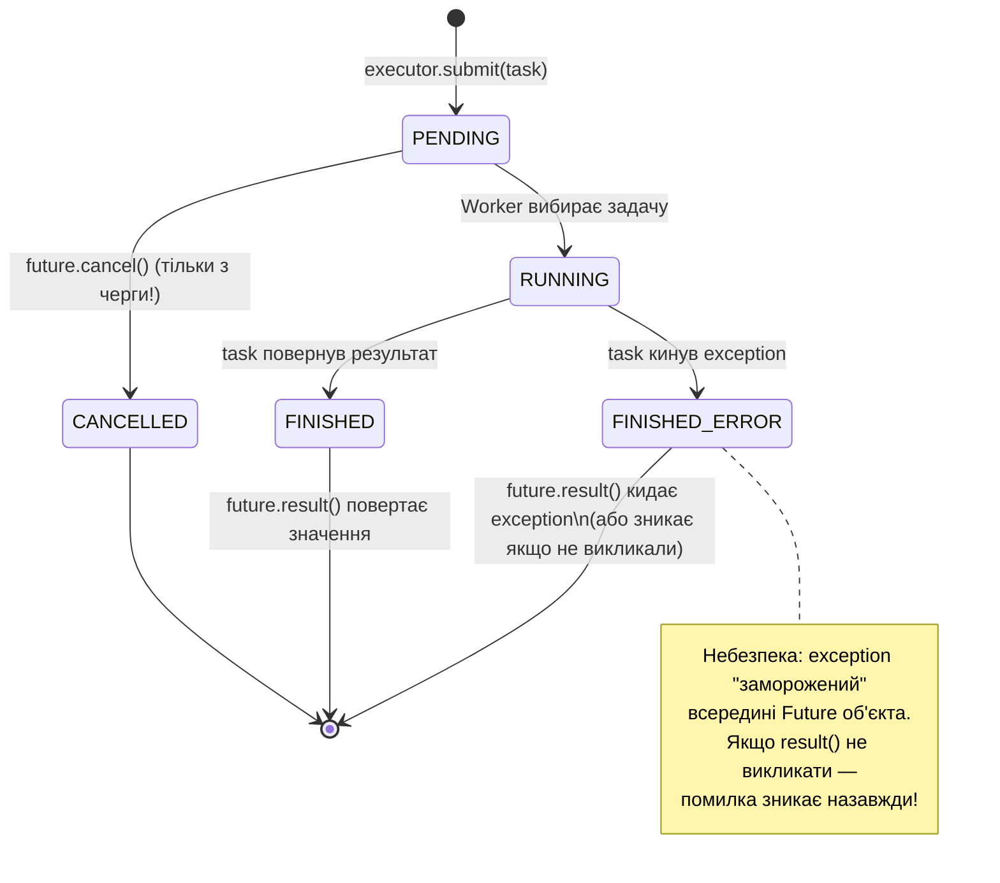
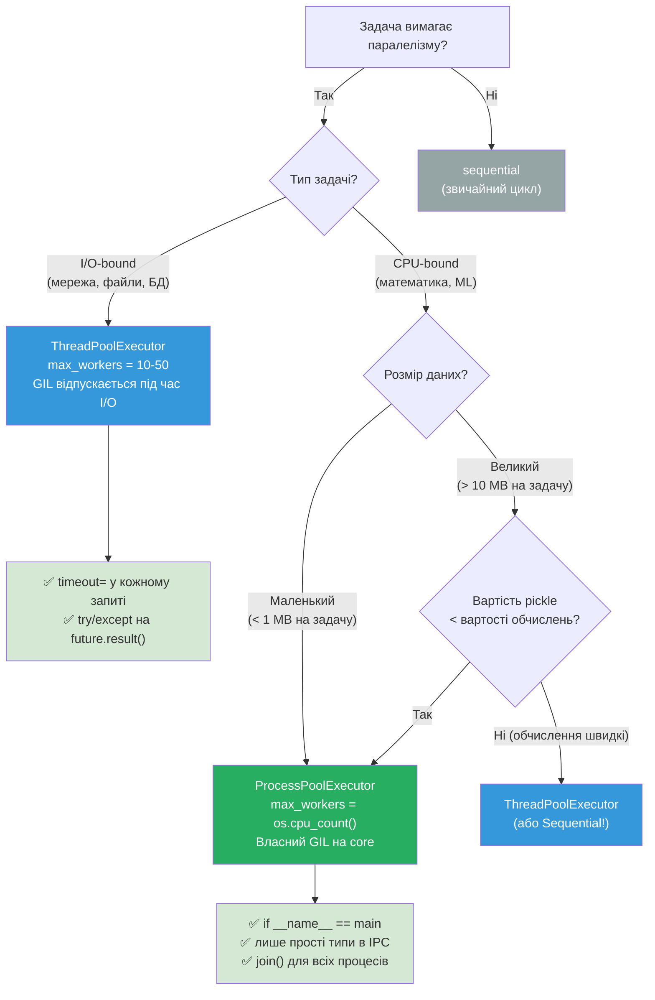
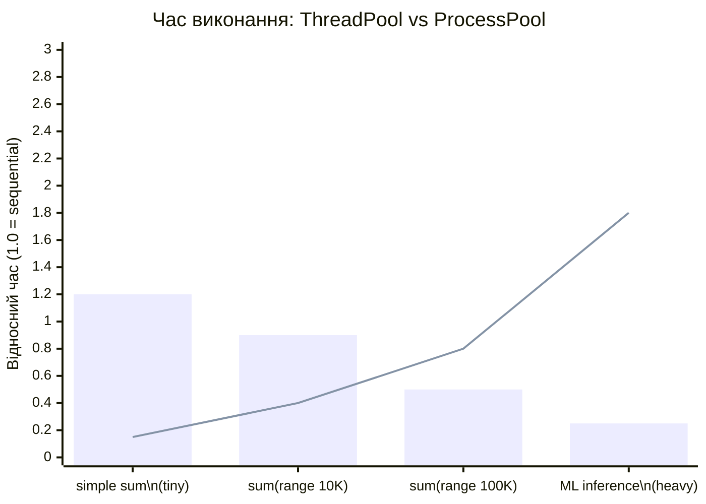
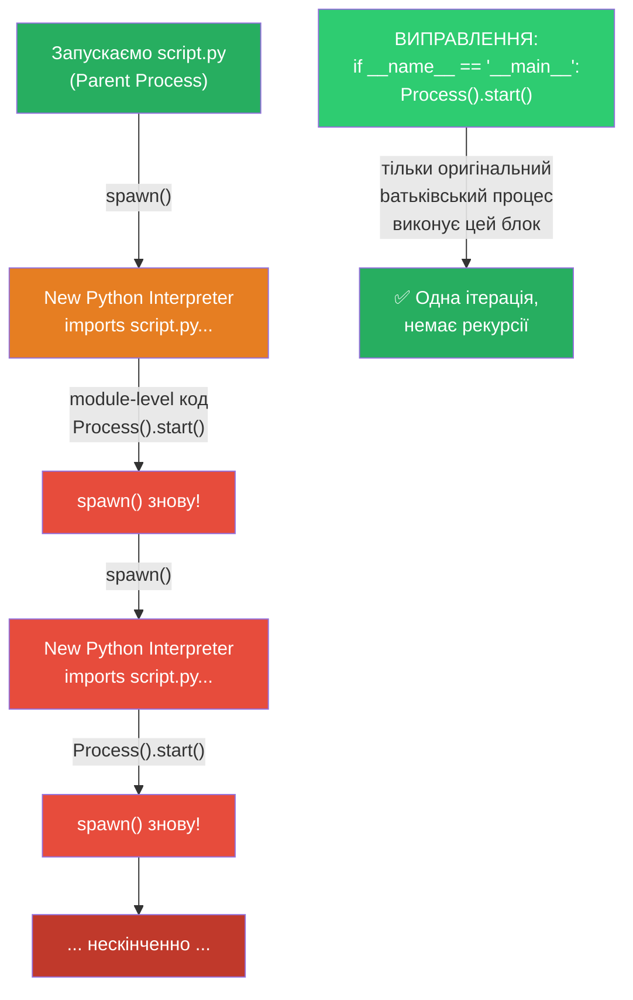

# Урок 33 — Mermaid Діаграми

## Діаграма 1: fork() — Клітинний поділ пам'яті

---

## Діаграма 2: GIL та CPU Cores

---

## Діаграма 3: IPC Pipeline — Як дані подорожують між процесами

---

## Діаграма 4: ProcessPoolExecutor Lifecycle

---

## Діаграма 5: Future — State Machine

---

## Діаграма 6: Дерево рішень — Threading vs Multiprocessing

---

## Діаграма 7: Серіалізація vs Обчислення (Коли ProcessPool програє)

> **Синя лінія** = ProcessPool (pickle overhead домінує на простих задачах)  
> **Зелені стовпці** = ThreadPool (стабільно для I/O-bound)  
> Точка перетину: ProcessPool виграє тільки коли обчислення складні

---

## Діаграма 8: Windows Spawn Bomb (без `__name__` guard)

